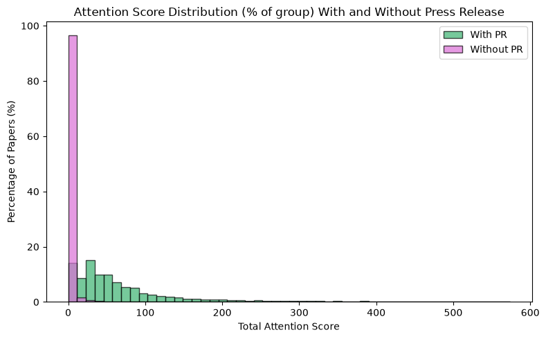
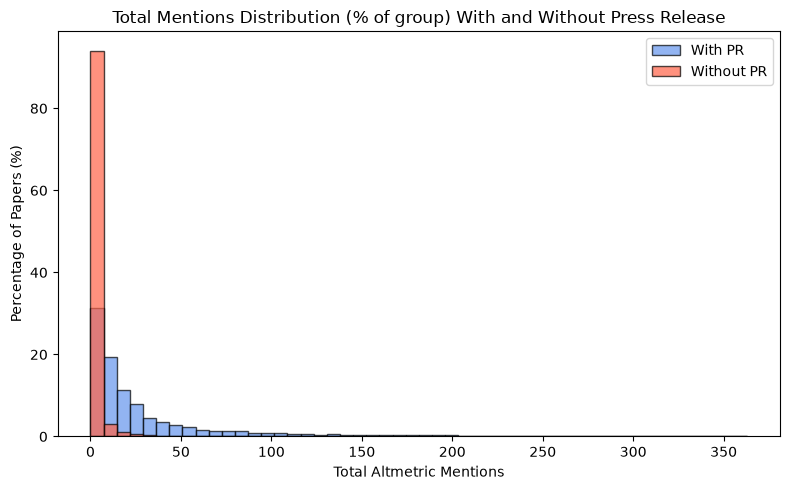

# EurekAlert Press Release: Matching & Impact Analysis

**Source:** `code/analysis.ipynb`  
**Data as of:** April 2026 Altmetric deliverable  

---

## 1. Dataset Overview

| Item | Count |
|------|------:|
| Papers in scope (`doi_list`) | 1,246,012 |
| Press releases in scope (2015+) | 376,607 |
| Papers with any Altmetric data (`altmet_df_joined`) | ~1,246,012 |

---

## 2. Press Release Matching - Stage by Stage

Matching uses a **waterfall pipeline** (`code/matching_pipeline.py`). Each pass runs only on press releases not yet matched by an earlier pass. The first hit wins.

### 2.1 Pre-Match: Scope Detection

Before matching, each press release is annotated with a candidate entity (institution or journal) via:

- Organisation name → crosswalk lookup
- Journal name → in-scope journal list

**Scope-only (in-scope but no DOI found): 22,253 PRs**

---

### 2.2 Matching Passes — `pr_paper_matched`

| Pass | Method | Tier | Match? | Matched PRs |
|------|--------|------|--------|------------:|
| 1 | `strict_doi` — PR DOI field exactly matches `doi_list` | A | Yes | **14,170** |
| 1b | `fulltext_doi` — DOI regex found in Summary / Full Text | A | Yes | **61** |
| 2 | `exact_title` — Article Title exactly matches paper title (in-scope only) | C | Yes | **107** |
| 3 | `in_scope_heuristic` — Org/journal in-scope, no paper link | E | No | **22,253** |

**Confirmed paper matches (is_matched = 1): ~14,338 PRs**  
**In-scope but unmatched (is_matched = 0): ~22,253 PRs**

---

### 2.3 Embedding Match — `embedding_title_match`

For the ~22,000 in-scope PRs without a DOI, a sentence-embedding similarity model compares press release text to paper titles within the same entity.

| Parameter | Value |
|-----------|-------|
| Minimum similarity threshold | 0.45 |
| Maximum date gap | 348 days (99th percentile from matched PRs) |
| Total candidates produced | **10,859** |
| Average similarity score | **0.574** |
| PRs with similarity ≥ 1.0 (exact text match) | Several hundred |
| PRs with similarity ≈ 0.45 (lower bound) | Long tail |

For the **impact analysis**, a stricter threshold of **≥ 0.70** is used to keep only high-confidence embedding matches.

---

### 2.4 Combined Press Release Universe (for Impact Analysis)

The impact analysis merges two sources:

```sql
SELECT pr_id, matched_doi FROM embedding_title_match WHERE embedding_sim > 0.7
UNION
SELECT pr_id, matched_doi FROM pr_paper_matched WHERE is_matched = 1
```

| Source | PRs included |
|--------|-------------:|
| `pr_paper_matched` (is_matched = 1) | ~14,338 |
| `embedding_title_match` (sim > 0.7) | incremental |
| **Combined `press_release_data`** | **15,627** |

---

### 2.5 Merge with Altmetric Data (`pr_altmet_merged`)

The combined press release list is left-joined onto the full Altmetric deliverable on `doi_norm`.

| Metric | Count |
|--------|------:|
| Matched press release DOIs | 15,627 |
| Rows in `pr_altmet_merged` (all entities) | 1,636,324 |
| Unique DOIs in merged table | 1,070,174 |
| Rows matched to a PR (`both`) | **32,203** |
| Rows without a PR (`left_only`) | 1,604,121 |
| Unmatched PR DOIs (`right_only`) | 0 |

> **Note:** Row counts exceed unique DOI counts because the same paper appears once per in-scope entity (institution, journal, publisher). The 32,203 `both` rows represent ~15,000–16,000 unique papers with press releases.

---

## 3. Impact of Press Release on Altmetric Attention Score

### 3.1 Outcome Variables

Two outcomes are used:

**A. Total Mentions** — unweighted sum of all available mention channels:

$$\text{total\_mentions} = \text{patent} + \text{policy} + \text{news} + \text{facebook} + \text{X posts} + \text{Bluesky} + \text{video mentions}$$

**B. Attention Score** — weighted composite following Altmetric's documented channel weights:

| Channel | Weight | Notes |
|---------|-------:|-------|
| `news_mentions` | **8** | Mainstream media |
| `policy_mentions` | **3** | Policy documents |
| `patent_mentions` | **3** | Patent citations |
| `bluesky_mentions` | 0.25 | Bluesky posts |
| `x_post_mentions` | 0.25 | X (Twitter) posts |
| `facebook_mentions` | 0.25 | Facebook posts |
| `video_mentions` | 0.25 | YouTube videos |


**Distribution** (1,070,174 unique papers after deduplication):

| Statistic | Total Mentions | Attention Score |
|-----------|:-------------:|:---------------:|
| Mean | 4.0 | 4.4 |
| Median | 0 | 0 |
| 75th percentile | 1 | 0.5 |
| Max | 31,491 | 12,545 |

Both distributions are heavily right-skewed (most papers have zero), so both regressions use `log(1 + outcome)`.

**Distributions of Outcome Variables**


*Figure 1: Distribution of Attention Scores (log1p scale)*


*Figure 2: Distribution of Total Mentions (log1p scale)*

The graphs above illustrate the highly right-skewed nature of both outcome variables, further motivating the use of a `log(1 + outcome)` transformation in all subsequent analyses.


---

### 3.2 Regression Setup

Both models use OLS (`feols`) with publication-year and entity fixed effects, and standard errors clustered by entity:

```
log(1 + outcome) ~ has_pr | pub_year + entity_name
vcov: CRV1 clustered by entity_name
```

`has_pr = 1` if the paper is linked to at least one EurekAlert press release; `has_pr = 0` otherwise.  
Sample after deduplication to one row per DOI: **14,452 PR papers** vs **1,055,722 non-PR papers**.

---

### 3.3 Results

**Model 1 — OLS on log(1 + total mentions)**

| Coefficient | Estimate | Std. Error | t value | p value | 2.5% CI | 97.5% CI |
|-------------|:--------:|:----------:|:-------:|:-------:|:-------:|:--------:|
| **has_pr** | **2.349** | 0.109 | 21.550 | 0.000 | 2.129 | 2.569 |

| Stat | Value |
|------|------:|
| Observations | 1,070,173 |
| RMSE | 0.858 |
| R² (overall) | 0.115 |
| R² (within FE) | 0.089 |

**Model 2 — OLS on log(1 + attention score)**

| Coefficient | Estimate | Std. Error | t value | p value | 2.5% CI | 97.5% CI |
|-------------|:--------:|:----------:|:-------:|:-------:|:-------:|:--------:|
| **has_pr** | **3.453** | 0.093 | 37.112 | 0.000 | 3.266 | 3.641 |

| Stat | Value |
|------|------:|
| Observations | 1,070,173 |
| RMSE | 0.814 |
| R² (overall) | 0.200 |
| R² (within FE) | 0.190 |

---

### 3.4 Interpretation

On the `log1p` scale, `exp(coef)` gives the approximate multiplier on `(1 + outcome)`:

| Model | Outcome | `has_pr` coef | Approx. multiplier | 95% CI (multiplier) |
|-------|---------|:-------------:|:------------------:|:-------------------:|
| 1 | Total mentions | 2.349 | **~10.5×** | (8.4×, 13.1×) |
| 2 | Attention score | 3.453 | **~31.6×** | (26.2×, 38.1×) |

- **Model 1:** PR papers have roughly **10.5× higher `(1 + total mentions)`** than comparable non-PR papers from the same entity and year.
- **Model 2:** PR papers have roughly **31.6× higher `(1 + attention score)`** — the larger effect reflects the higher weight given to news mentions (weight 8), which are most directly driven by a press release.

---

## 4. Limitations

| Limitation | Detail |
|------------|--------|
| **Observational, not causal** | Papers selected for press releases are likely already more newsworthy. Both coefficients reflect association, not proof the PR caused the attention. |
| **Cross-sectional Altmetric data** | Scores are lifetime totals at one snapshot (Apr 2026), not a daily time series. Before/after comparisons around the PR date are not possible with current data. |
| **Partial channel coverage** | The deliverable includes 7 of the ~20 channels Altmetric tracks. Missing channels (blog, podcast, Wikipedia, peer review, etc.) mean the attention score is a lower-bound approximation. |
---

## 5. Next Steps

1. **Timestamped mention data** — request a time-series bulk export from Altmetric (or use the Fetch/Mentions API for the ~15k matched DOIs) to enable a before/after event study around the PR publication date.
